# TECLA-CERO(セロ)の３Dプリント印刷設定例
キーケット2026に展示していたキーボードを作る際に設定したプリント設定を参考情報として記載させていただきます。

# 3Dプリントの機種
BambuLab A1 mini

# ビルドプレート
* テクスチャPEIプレート（A1 mini購入時のもの）
* (ノブ/トラックボールケース) スムースPEIビルドプレート

# フィラメント
PLA Matte(Black)

# Bambu Studio設定
バージョン：2.5.0.66  
システムプリセット： 0.20mm Standard @BBL A1M  
フィラメント設定など：デフォルト(変更なし)

# Stepファイルの読み込み設定
デフォルト  
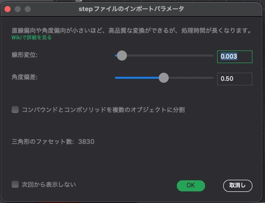

# 各種設定について
左右に関して基本的には同じ設定をしています。(そして試行錯誤していたので1プレート1オブジェクトで印刷しておりました・・・ので印刷される際には複数配置などしてください)

## サポート有効化（パラメータはデフォルト）の設定
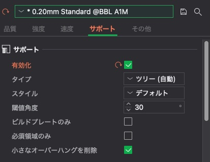
# Topプレート
サポート：有効化（パラメータはデフォルト）  
配置向き：マグネットを入れる口が上向きになるように配置してください。  
備考：今回は反ることがなかったのでブリムはつけておりません。必要に応じてセットしてください。
## 配置
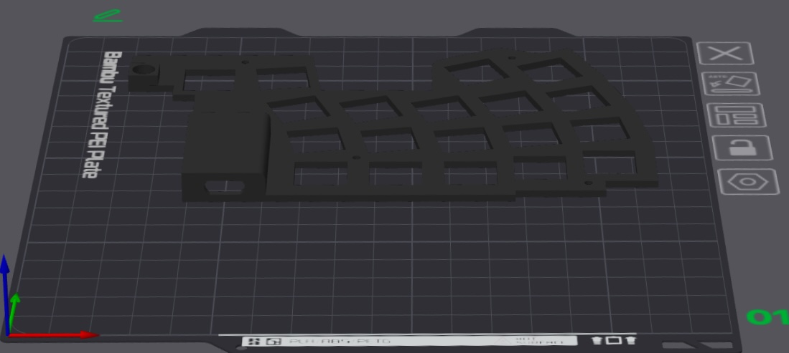

# 電池ケース
サポート：有効化（パラメータはデフォルト）  
配置向き：マグネットを入れる口が下向きになるように配置してください  
サポート編集：薄い部分と底面から離れている部分にサポートが有効になるように色付けしてください（私のは適当でちょっと恥ずかしいのですが。。。）

## 配置
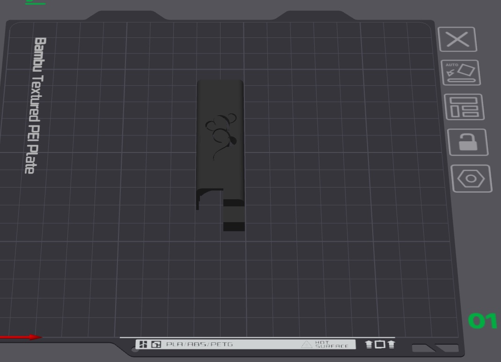

## サポート編集：薄い部分
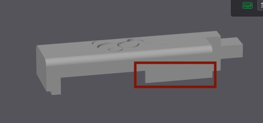
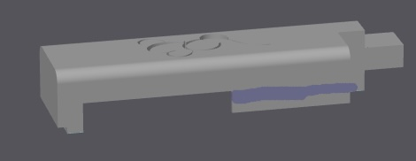
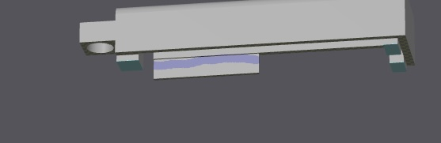

## サポート編集：底面から離れている部分
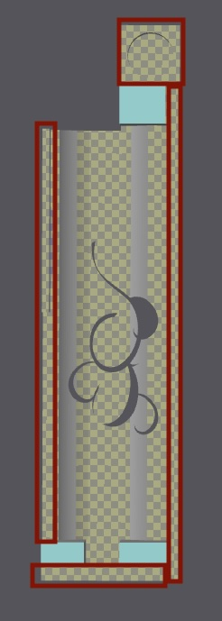
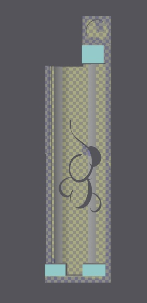   
※わかりにくいですが薄い紫色がついているところです

## プレビュー
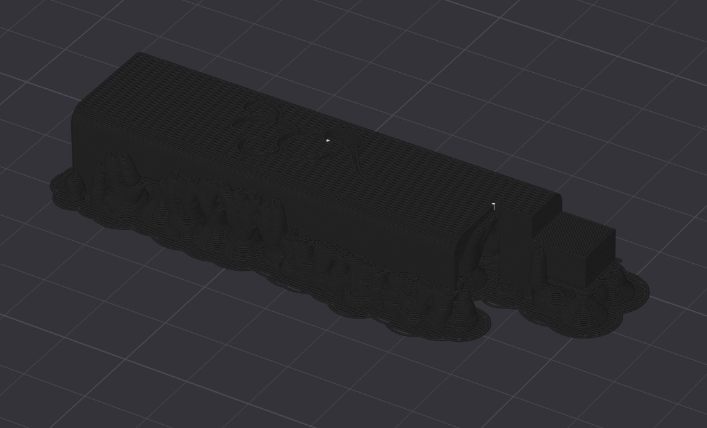  

# ボトムケース
サポート：有効化（ブリムの関係？自動的についている）  
配置向き：底面が下になるように配置してください。  
マウス耳型ブリム：角全てに設定（親の仇かという感じで付けてました）  
ベッド接着：ブリムタイプ塗装済み  
備考：反ってしまう場合は洗濯ノリを使ってプリントするといいですよと聞きましてご自身の責任でお試しください。[参考記事](https://note.com/jinsato_tech/n/n6989bb54e91c)

## 配置
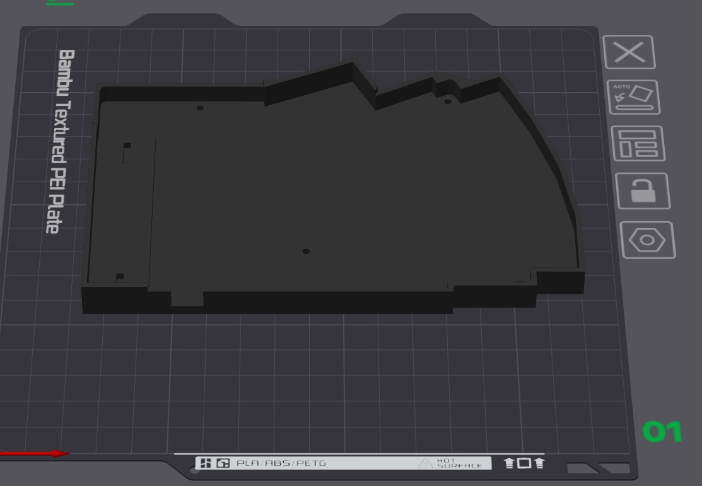  

## ブリム
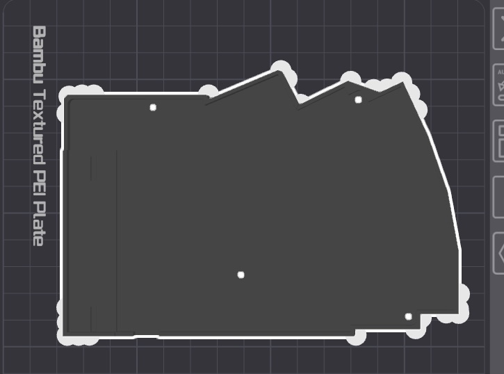  

### ブリム設定
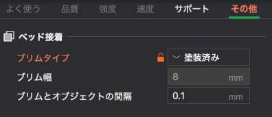 

## プレビュー
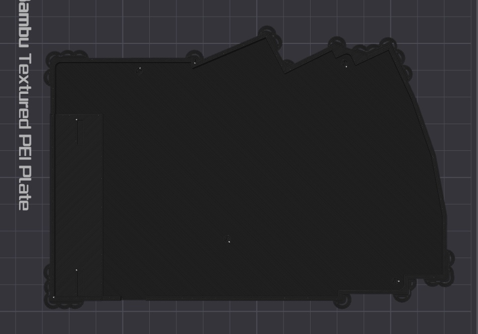

# ノブ
配置向き：ノブに刺す穴を上になるように配置してください

## 配置
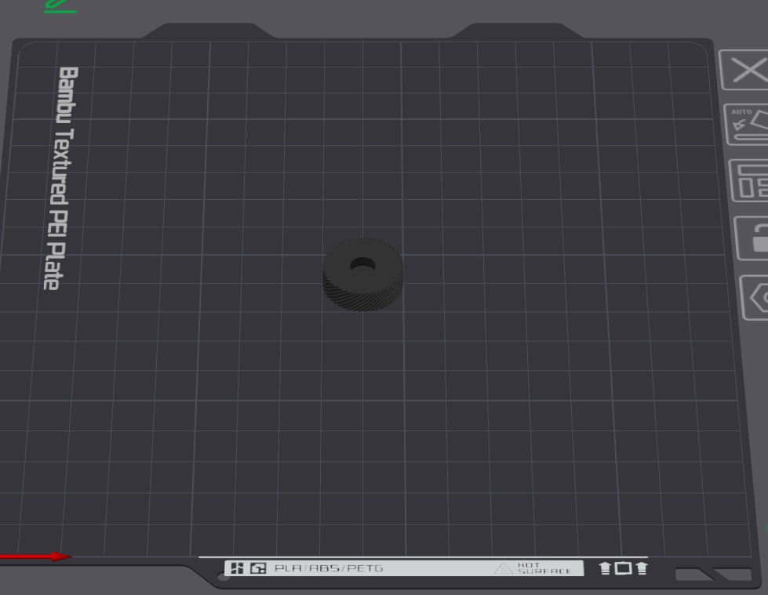

# 一体型トラックボールケース
サポート：有効化（パラメータはデフォルト）  
配置向き：トラックボールを奥側を上に配置してください  
座標：Zを8度回転
## 配置
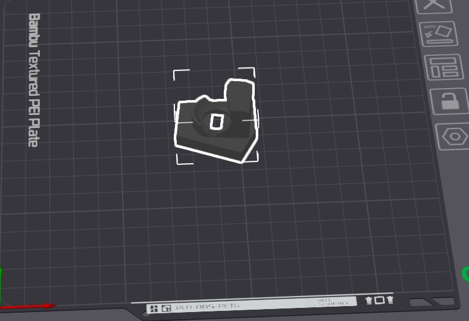

## 座標
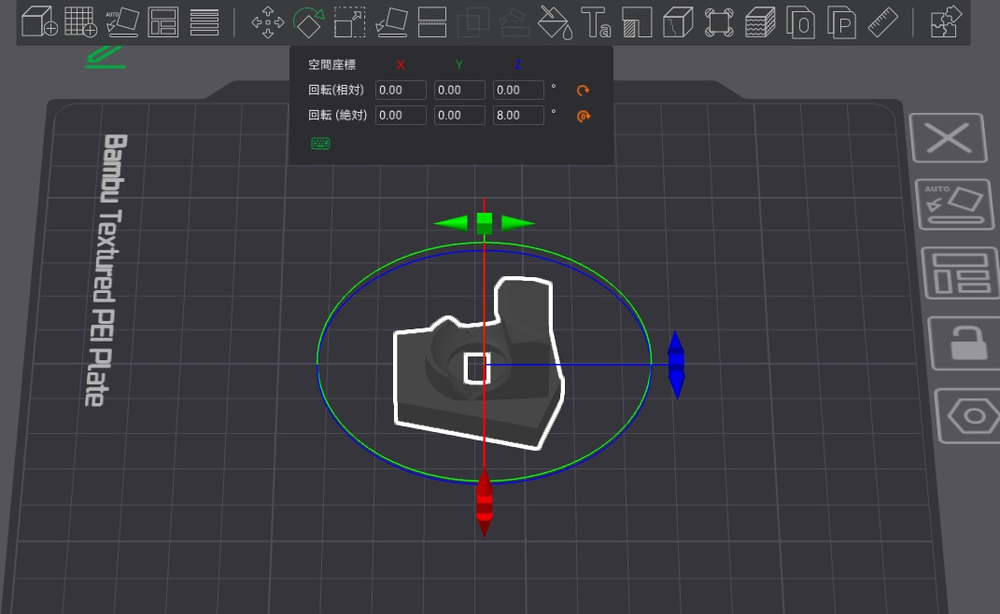

## プレビュー
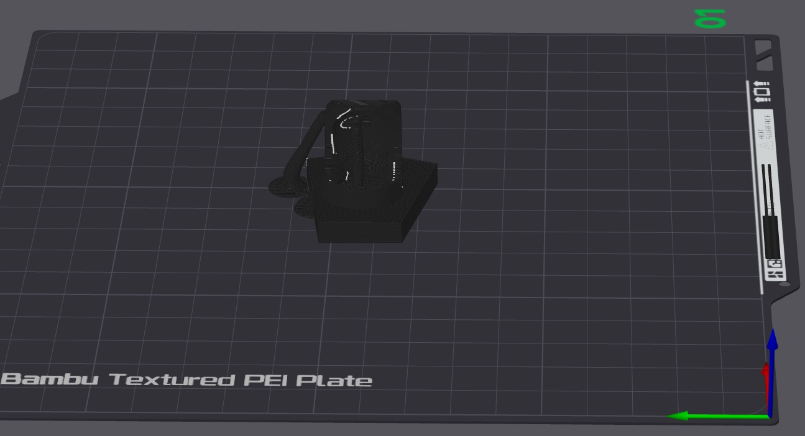
※わかりにくいですがサポートが設定されている状態

