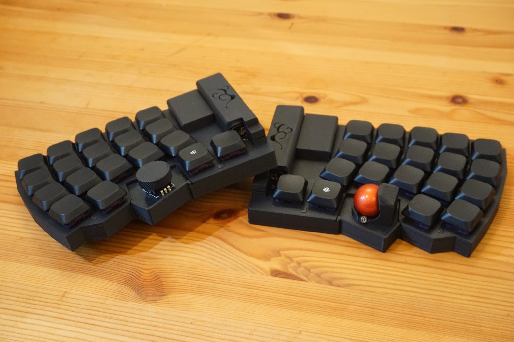

# TECLA-CERO(セロ)
シンプルなロータス配列の乾電池・トラボ付き無線分割キーボードです。

## 特徴
- ロータス配列
- 38キー
- 左側にロータリーエンコーダー
- 右側にトラックボール（PAW3222）
- BMP Boost使用
- BLE/USB両対応
- keymap-editor / ZMK Studio対応 

## ビルドガイド
- [こちら](https://github.com/nktn/tecla-cero/blob/main/docs/buildguide_proto.md)を参考に進めてください

## 注意
- ソケット、ロータリーエンコーダー、電池ボックスのはんだ付けが必要です。
- ケースが3Dプリントでの確認しかできておりません

## 謝辞
本プロジェクトの設計は[torabo-tsuki-lp](https://github.com/sekigon-gonnoc/torabo-tsuki-lp) を参考にさせていただきました。