# Build Guide for TECLA-CERO

こちらはTECLA-CEROのビルドガイドです。  
**はんだ付けが必要です**

また、プロトタイプということでケースが**3Dプリンターでの印刷**確認しかできておりません。

## プロト販売の同梱品
| 名称                                                     | 数  |備考|                                                                 
|:-|:-|:-|
| プロトタイプメイン基板(PCBAで半組み立て済み)                                               | 1   | プロト版として部品番号がプリントされたデザインです　|
| 電池ボックス(単三)                                       | 2   |入手先：[秋月電子](https://akizukidenshi.com/catalog/g/g100308/)|
| スペーサー(6mm)                                        | 8   |入手先：[遊舎工房](https://shop.yushakobo.jp/products/a0800c2?variant=37665435189409)|
| ねじ(M2x3.5)                                             | 18  |入手先：[ウィルコ](https://wilco.jp/products/F/FX-EB.html#page3)|
| ロータリーエンコーダー (ロープロファイル)                                           | 1  |入手先：[遊舎工房](https://shop.yushakobo.jp/products/2141?variant=37799941963937)|
| フレキシブルケーブル(0.5mmピッチ、6P、100mm、電極同一面) | 1   |トラックボール用部品 / Amazonなど|
| ベアリング(4x1.5x2 mm)                                   | 3   |トラックボール用部品 / 入手先:[Amazon](https://www.amazon.co.jp/dp/B0CV75YFQY)|
| ねじ(M1.4)                                               | 3   |トラックボール用部品 / 入手先:Amazonなど|
| (同梱はおまけ)19.05mm トラックボール | 1     |BOOTHやAliexpressなどありますが、 [BEEKEEBのオレンジレッド](https://shop.beekeeb.jp/products/19mm-trackball)がおすすめです。|
| キースイッチソケット(Choc V2)                          |38 | 入手先：[遊舎工房](https://shop.yushakobo.jp/products/a01ps?variant=37665172553889) など |

## 別途入手が必要な部品

| 名称                                                     | 数  |備考|
|:-|:-|:-|
| BMP Boost                                      | 2     | 入手先：[BOOTH](https://booth.pm/ja/items/1177319), [遊舎工房](https://shop.yushakobo.jp/products/10737) |
| トラックボールセンサー(14mmマウスセンサーモジュール)     | 1   |   入手先：[BOOTH](https://nogikes.booth.pm/items/6520217)
| キースイッチ(Choc V2)                          |38 |配布の3dp版は静音スイッチが良いかと思います。|
| キーキャップ                                   | 38  | 19mmのロープロファイル用のキーキャップ|
| コンスルー                                     | 4     | 13ピン（高さ2.5mm）を使用してください。/ 入手先：[遊舎工房](https://shop.yushakobo.jp/products/31?variant=37665714438305)                            |
| 乾電池                                       | 2     | 単三、Ni-MH可。USBで充電できるリチウム電池内蔵のものを使う場合、必ずキーボードから取り外してから充電してください                                |
| 瞬間接着剤                                       | 1     | 入手先：[amazon](https://www.amazon.co.jp/dp/B009AO65NS) |
| ネオジムマグネット                                       | 4     | 直径6mmのマグネット。入手先：[100均ショップ：キャンドゥなど](https://netshop.cando-web.co.jp/view/item/000000023967)|
ゴム足                                            | 8   |GRIPLUSのものがおすすめですが、お好きなものをご準備ください
| トッププレート(3dp版)                                           | 2   |[3df-files/for-3dpフォルダ](https://github.com/nktn/tecla-cero/tree/main/3d-files/for-3dp)のファイルを３Dプリンターで印刷してください|
| ボトムプレート(3dp版)                                             | 2   |[3df-files/for-3dpフォルダ](https://github.com/nktn/tecla-cero/tree/main/3d-files/for-3dp)のファイルを３Dプリンターで印刷してください|
| 電池ケースカバー(3dp版)                                             | 2   |デザインありとなしの２種類あります。お好みで[3df-files/for-3dpフォルダ](https://github.com/nktn/tecla-cero/tree/main/3d-files/for-3dp)のファイルを３Dプリンターで印刷してください|
エンコンダーノブ(3dp版)                                             | 1   |[3df-files/for-3dpフォルダ](https://github.com/nktn/tecla-cero/tree/main/3d-files/for-3dp)のファイルを３Dプリンターで印刷してください|

## 利用工具
- はんだごて
- はんだ
- ニッパー
- ペンチ
- ドライバー
- やすり
- PC
- USBケーブル

## 組立手順

### キースイッチソケットをメイン基板にはんだ付けする
左右のメイン基板にキースイッチソケットをはんだ付けしていく。
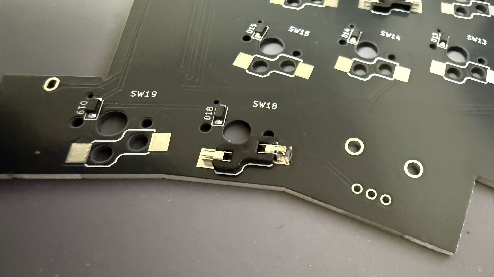
### ロータリーエンコーダーを左側のメイン基板にはんだ付けする
左のメイン基板の裏面に3箇所はんだ付けをしていきます。
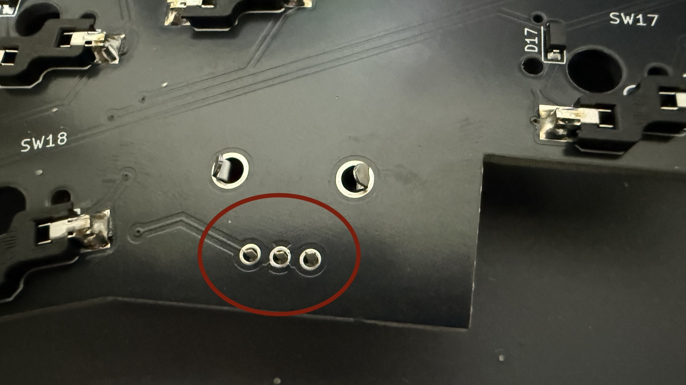
### 電池ボックスをメイン基板にはんだ付けする
1. 電池ボックスの足を折り曲げる。

2. プラスやマイナスの向きに気をつけてメイン基板を載せ、余った足を短く切ってはんだ付けをする。
※プラス側・マイナス側両方ともハンダ付けをしてください。

ここではんだ付けは終わりです。

### メイン基板にBMP Boostをコンスルーで取り付ける
左右のメイン基板につけます。はんだ付けは不要です。  
※必ずコンスルーの向きは揃えてください。
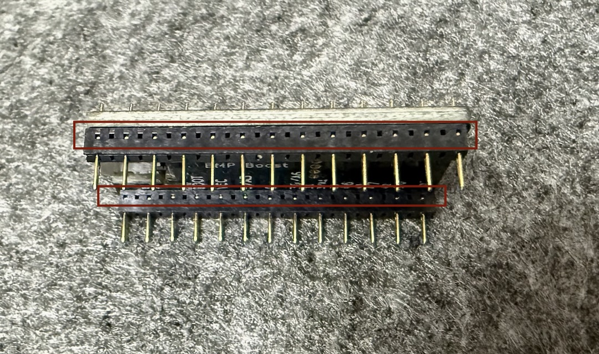

### トッププレート・メイン基板にスイッチを差し込む
メイン基板にトッププレートを重ねてスイッチを差し込んでください。
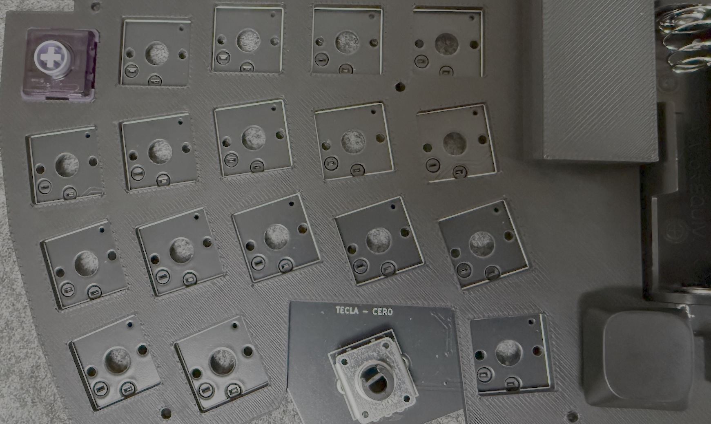

ロータリーエンコーダーにノブをつけてください。
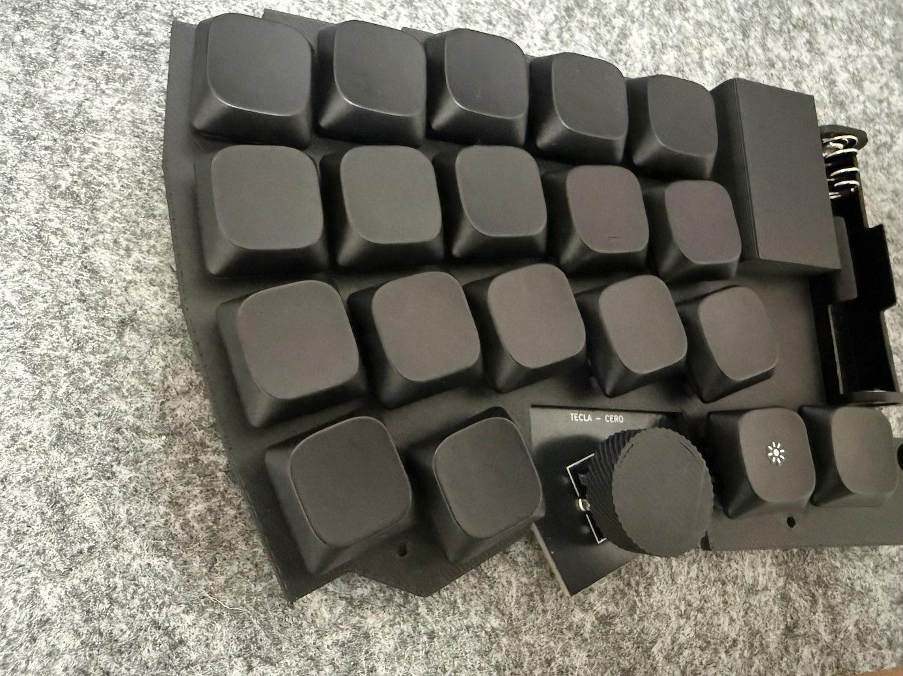

### トッププレートにスペーサーをねじ止めする
左右両方に4箇所ずつねじ止めしてください。
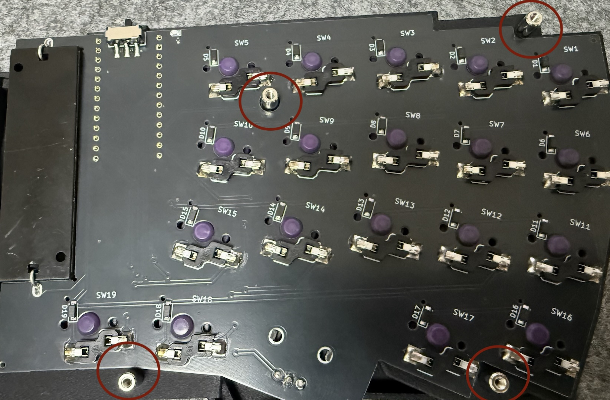
### ファームウェアを書きこむ
1. スイッチをOFFにした状態で、BMPをPCにUSBケーブルで接続します。
2. BLEMICROPROという名前のストレージがマウントされたら、中身にINFO_UF2.TXTがあることを確認してください。
3. [Releases](https://github.com/nktn/zmk-keyboard-tecla-cero/releases)からファームウェアのuf2ファイルをダウンロードします。
4. uf2ファイルを1つ選んでストレージにコピーしてください。
トラックボールがある方をCentral、ない方がPeripheralが良いかと思います。（逆でも動くことを確認はしています）
※つまり右手にtecla_cero_right_central.uf2、左手にtecla_cero_left_peripheral.uf2を書き込んでください。
書き込みが完了したら一度USBケーブルを抜き、スイッチをONにした状態でUSBケーブルを差し直すとキーボードとして動作します。
### トラックボールケースにベアリングをネジで固定
穴にねじを押し込みながら回してベアリングを固定してください。
### トラックボールセンサーにケーブルを差し込む
コネクタの黒いのフラップを上に持ち上げ、トラックボールのケーブルをしっかり奥まで差し込み、フラップを下げてください。  
※右側に取り付けます。  
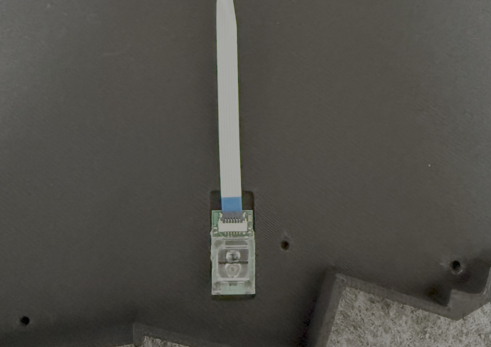
### トラックボールのケーブルを右側のメイン基板のコネクタに差し込む
こちらも同様にケーブルを差し込み、フラップを下げてください。
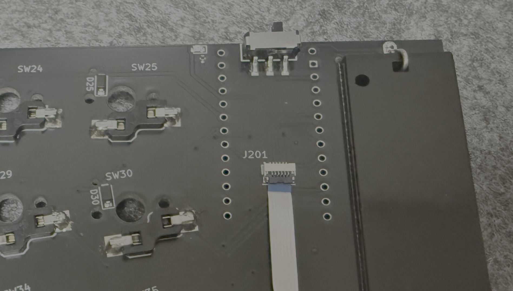
### トラックボールセンサーの動作確認をする
USBケーブルでPCとBMP Boostを接続してレンズの上空を指で動かしたりしてマウスカーソルが動くか確認してください。
センサーの動作確認ができたらUSBケーブルは取り外してください。
### トラックボールセンサーを右側のボトムプレートに取り付ける
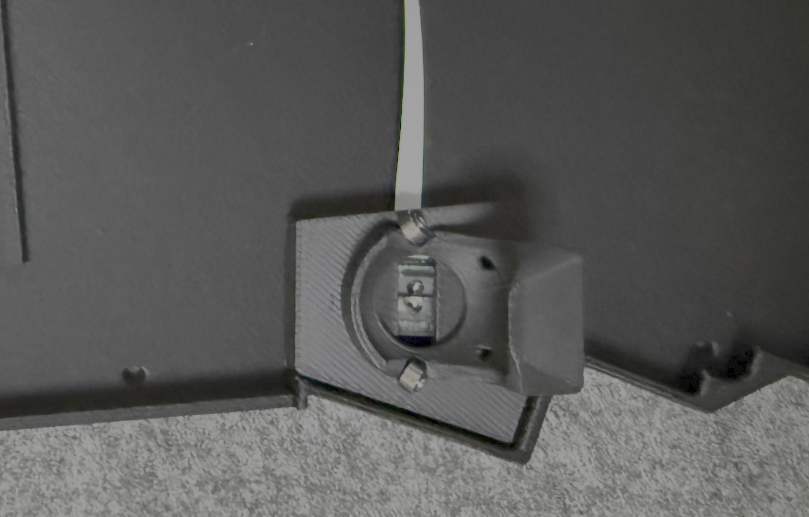
裏から2箇所ねじ止めをしてください。
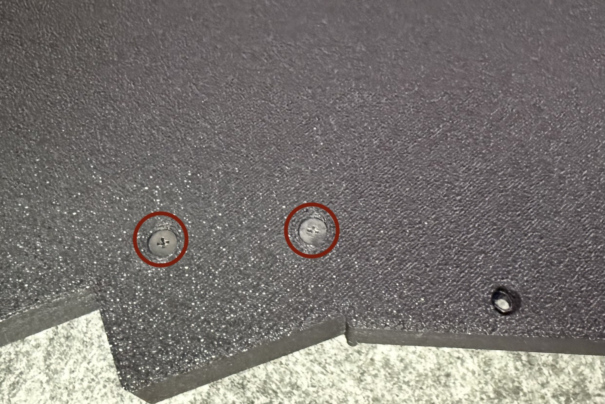
### ボトムプレートの取り付けとゴム足をつける。
トッププレートとボトムプレートを重ねて裏側のねじを止めて完成です。(※写真は左側のものです。左右とも取り付けてください)
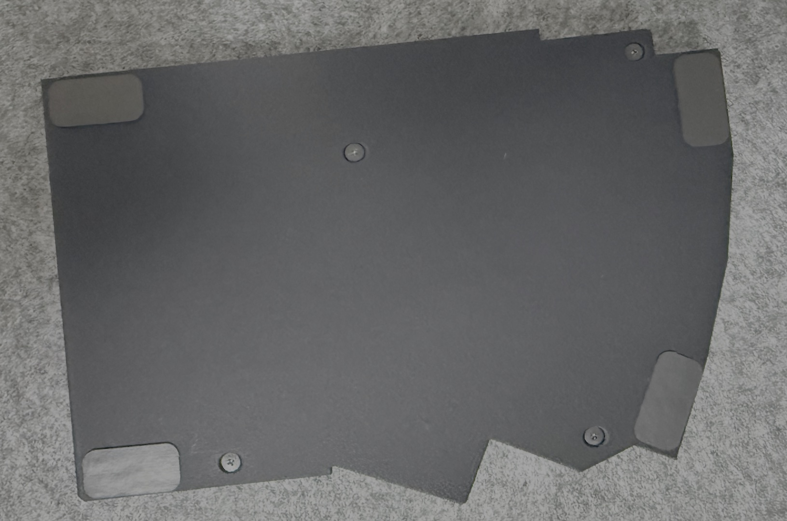
### 磁石をトッププレートに嵌め込む
※瞬間接着剤の取り扱いに気をつけてください。
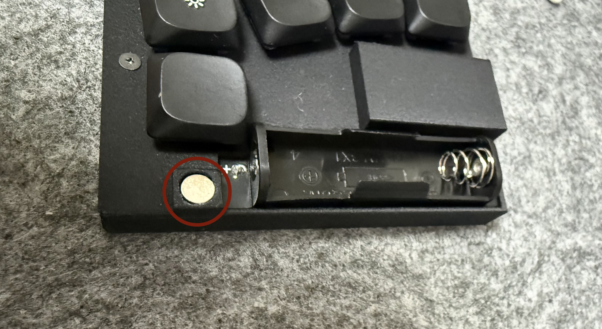
### 磁石を電池ケースを嵌め込む
※瞬間接着剤の取り扱いに気をつけてください。
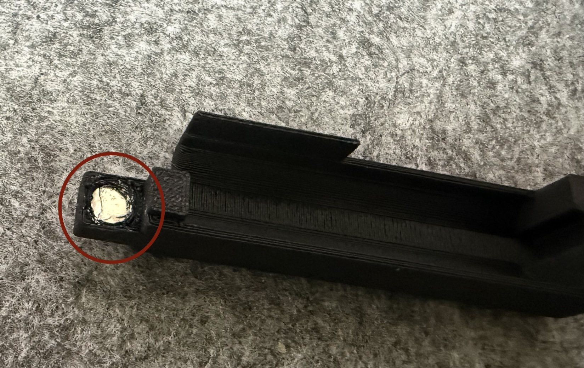
電池ケースをトッププレートに重ねたら完成です。  
現時点の電池ケースは被せて磁石でとめている感じになります
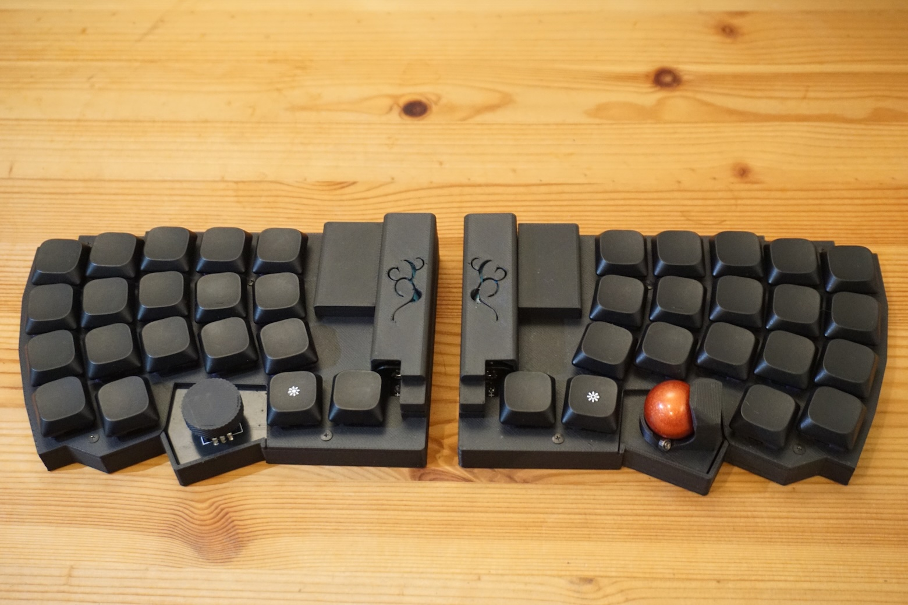

## 使い方

### 電源の説明
スライドスイッチをON側に切り替えると電源が入ります。電源がONするとLEDが点滅します。

### LEDの説明
BMP Boostの付近に赤色LEDがついています。
試験的に作ったケースのため電源スライドスイッチの穴から光を確認してください。
### 無線接続
両手の電源スライドスイッチをONして、接続先のデバイスでペアリングします。

### キーマップを変更する

* [ZMK Studio](https://zmk.studio/)または[Keymap-Editor](https://nickcoutsos.github.io/keymap-editor/)でキーマップが変更できます。
* Keymap-Editorを使用する場合は[zmk-keyboard-tecla-cero](https://github.com/nktn/zmk-keyboard-tecla-cero)をクローンして編集してください。
  * [ファームウェアの書き込み方](#ファームウェアを書きこむ)同様に、新しく作ったuf2ファイルを書き込んでください。

## トラブルと対策

* 初期不良による部品交換が必要な場合や、組立ミスで一部購入したい場合は[XからDMメッセージ](https://x.com/milio_kbd)をお送りください(booth専用ページを案内します)
* 組立にあたってのトラブルで相談がある場合は本リポジトリのissueに投稿してください。
* 煙が出たり異常な状態になりましたら、使用を中止して電源を切り電池を抜いてください。
* 長期間使用しない場合は電池を取り出してください。